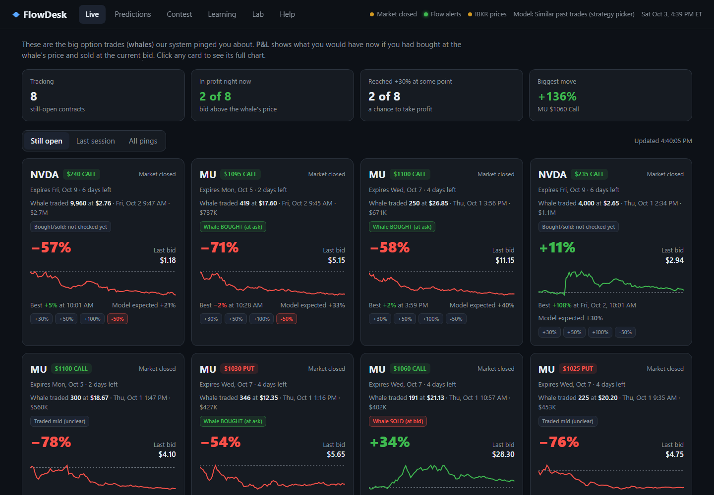
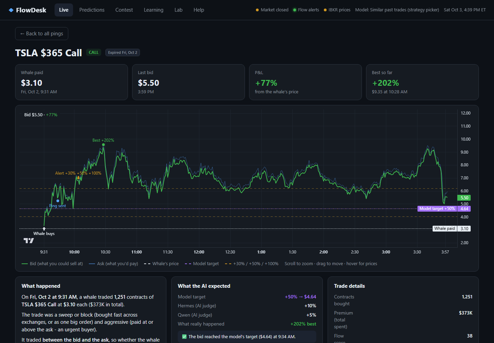
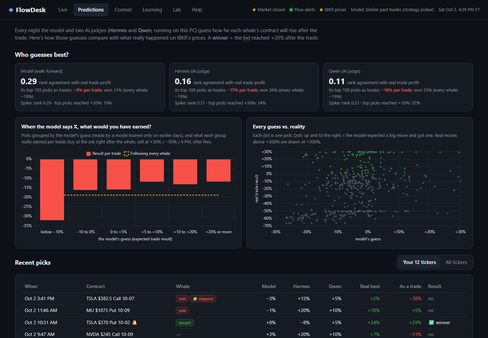
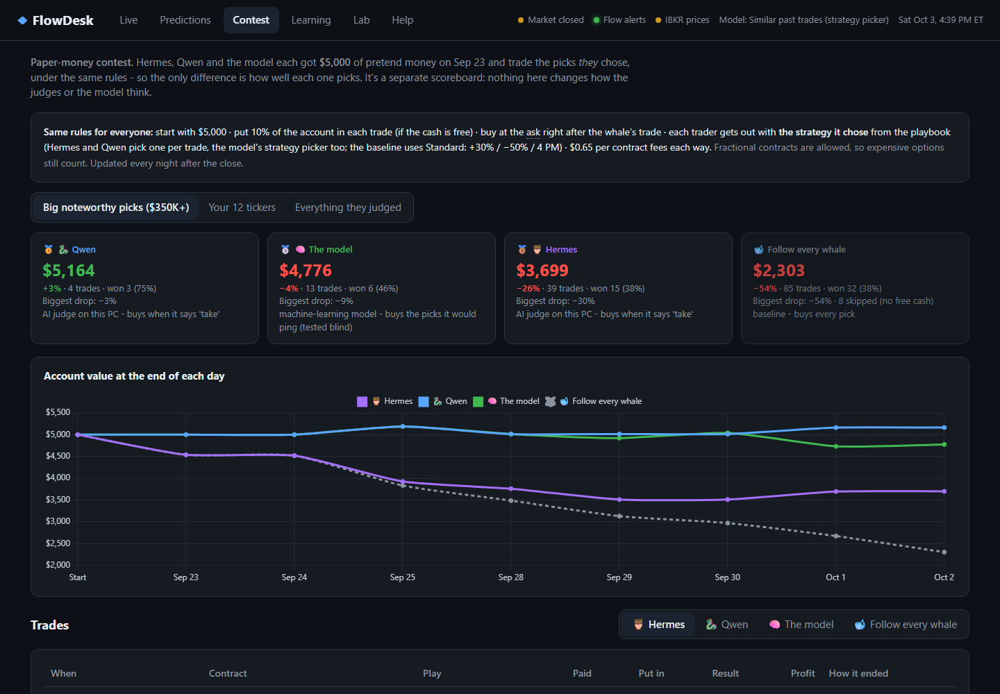
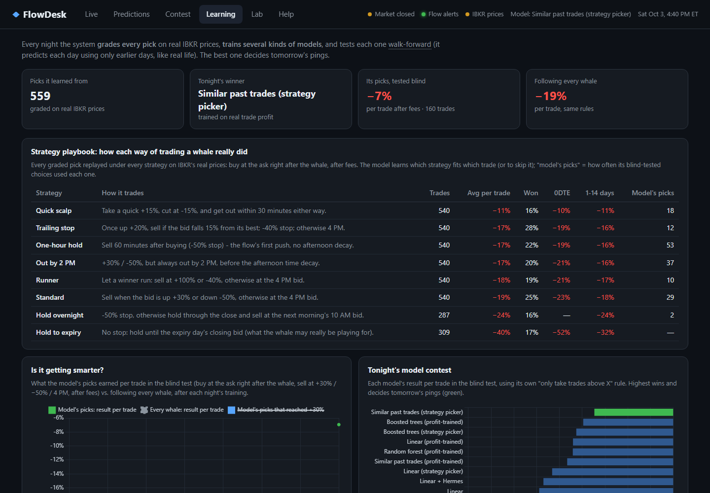
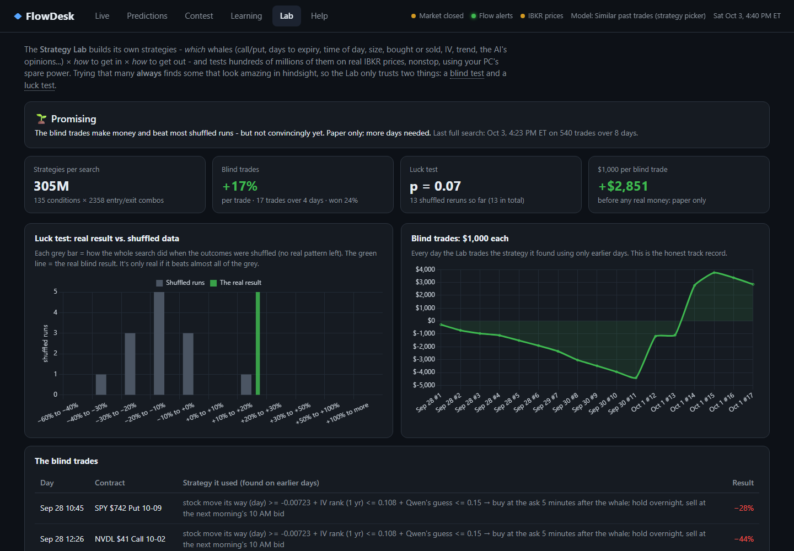

# Options Flow Research + FlowDesk

A local, always-on research system that asks one question honestly: **when a "whale" makes a big options trade, can you make money following it - and if so, which whales, and how?**

It captures big options trades from [Trade Echo](https://tradeecho.com), checks each one (was the whale *buying* or *selling*? one leg of a spread?), lets two local AI judges and a nightly-retrained model decide whether - and how - to trade it, and pings the best ones to Discord. Every trade is then graded on **real Interactive Brokers (IBKR) prices**: what you would really have paid (the ask) and really have sold at (the bid), after fees. **FlowDesk**, a beginner-friendly desktop app, shows all of it live, and the **Strategy Lab** keeps searching for profitable strategies around the clock - and refuses to call anything profitable unless it survives a blind test and a luck test.

Everything runs on one Windows PC. No cloud AI is used at runtime.

> **Research software, not financial advice.** It never places orders: the IBKR connection is market data only, and account, position and order calls are blocked in code. Nothing has been proven profitable yet (see [Results so far](#results-so-far)).



## Contents

- [What it does](#what-it-does)
- [How it works](#how-it-works)
- [FlowDesk](#flowdesk-the-desktop-app)
- [How the models learn](#how-the-models-learn)
- [The Strategy Lab](#the-strategy-lab)
- [Honesty rules](#honesty-rules)
- [Results so far](#results-so-far)
- [Files](#files)
- [Setup](#setup)
- [Running it](#running-it)
- [Roadmap](#roadmap)

## What it does

| | |
|---|---|
| **Captures whales** | Trade Echo's scored *noteworthy* list (score > 30, 0-14 days to expiry, $350K+) for 12 tickers (SPY QQQ NVDA INTC DRAM MU META CRWV HIMS TSLA GOOG PLTR), plus a market-wide **whale watch** on Trade Echo's raw feed - which sees trades within ~3 seconds, while the scored list can lag 5-10 minutes at the open. Two Trade Echo connections use the full 150 credits/hour. |
| **Checks each whale** | **Bought or sold?** (Trade Echo's trade sentiment, cross-checked against IBKR's bid/ask that minute) and **spread or hedge?** (other legs printed in the same second with a matching size: verticals, calendars, straddles, collars). It never pings a whale that *sold* - following it would mean betting the other way. |
| **Decides** | Two local AI judges (Hermes 3 and Qwen 3 via Ollama) and a machine-learning **strategy picker** choose take/skip **and a strategy** for each trade. |
| **Pings** | Discord: the contract, whale side, the chosen play ("🎯 Play: One-hour hold - model expects +6%"), Greeks, then live follow-ups at +30% / +50% / +100% / -50%. |
| **Tracks prices** | IBKR (read-only, OPRA): live bid/ask streams from the minute a whale is spotted, 1-minute bars, Greeks, open interest, the companion contracts of big whales for future spread strategies. |
| **Grades honestly** | Every trade on real IBKR bars: buy at the ask right after the whale, sell at the bid, $0.65 per contract each way. |
| **Learns every night** | Replays every trade under 8 strategies, retrains every model type blind (walk-forward) and promotes whichever *earns* the most per trade. |
| **Searches nonstop** | The Strategy Lab tests ~300 million home-made strategies per search on spare CPU, trusting only blind and luck tests. |
| **Shows everything** | FlowDesk: Live, Predictions, Contest, Learning and Lab screens. |
| **Watches itself** | 28 data-integrity checks every 30 minutes, a local-AI audit, incident cases investigated by local Qwen, Discord alerts when anything breaks. |

## How it works

```
                       Trade Echo (MCP)
  connection 1: noteworthy list every 2 min      connection 2: whale watch (raw tape, every 90 s)
  + per-ticker flow + Dealer Edge                  -> IBKR streams start the moment a whale is seen
                 |
                 v
  rules (12 tickers, score > 30, 0-14 DTE, $350K+)
  -> trade context: whale bought / sold / mid? spread leg?      (2 credits, never holds up polling)
  -> AI judges (Hermes 3 + Qwen 3, local GPU): take/skip + a strategy from the playbook
  -> strategy picker (ML): expected result of each strategy -> best play, or skip
  -> Discord ping (never when the whale sold) + live follow-ups
                 |
  IBKR TWS (read-only): live bid/ask, 1-minute bars, Greeks, open interest, spread legs
                 |
  Nightly: sweep missed picks, add whale-size raw prints as training data, IBKR prices,
           replay every trade under every strategy, walk-forward model contest, reports
                 |
  Strategy Lab (nonstop, idle priority): ~300M strategies per search, blind test + luck test
                 |
  FlowDesk (read-only desktop app) <- flow.db (SQLite)
```

### Daily cycle

| When | What |
|---|---|
| **Market hours (9:30-4:00 ET)** | Noteworthy every 2 min, whale watch every 90 s, trade-context checks, judges + model + pings. The IBKR tracker streams up to 70 contracts (pings first, then fresh whales), records your ask at each ping, Greeks and stock context every 5 min, and posts live follow-ups. Integrity checks every 30 min. |
| **After the close (4:15 ET)** | Sweep for missed picks, turn the day's whale-size raw prints into training picks, judge everything, IBKR prices, replay every strategy, retrain, integrity check + local AI audit, bot reports. |
| **Overnight (until 9:00 ET)** | Harvest extra real training data with spare credits (both connections), trade-context backfill, IBKR prices for new picks, spread legs, Greeks, retrain. |
| **Always** | The Strategy Lab re-searches whenever graded data changes and runs luck tests in between. |

## FlowDesk (the desktop app)

A local desktop window (desktop shortcut, or `pythonw flow_app.py`) for following everything without reading logs. It only **reads** `flow.db` - it never connects to IBKR or Trade Echo and never writes - so it can't disturb the live system. Hover over any dotted word for a plain-English explanation; the Help tab has the full glossary.

| Screen | What it shows |
|---|---|
| **Live** | Every pinged contract still open (or the last session, or all): P&L from the whale's price to the live bid, best-so-far, bought/sold and spread badges, the model's play, alerts. |
| **Contract page** | Minute-by-minute bid/ask since the whale, with the whale's buy, when the whale watch saw it, when our ping went out, the alerts, the model's target, and the story of the trade in sentences. |
| **Predictions** | Model vs. Hermes vs. Qwen on real trade results: rank agreement with profit, what their top picks earned, "when the model says X, what would you have earned", every guess vs. reality, recent picks. |
| **Contest** | Paper money: Hermes, Qwen and the model each start with **$5,000** and trade the picks - and the strategies - *they* chose under the same rules (10% per trade, buy at the ask right after the whale, $0.65/contract fees), vs. a "follow every whale" baseline. A separate scoreboard: never fed back into the judges or the model. |
| **Learning** | The strategy playbook (how each way of trading did), nightly training history, the model contest, the day-by-day blind replay, what the model looks at, and an **exit simulator** (pick trades, whale side, entry price, take-profit and stop-loss; replayed on real minute bids; heat map of every combination). |
| **Lab** | The Strategy Lab's honest status: blind trades, luck test, the strategies it is using, and the best ones in hindsight (labelled "not proof"). |

| Contract page | Predictions |
|---|---|
|  |  |
| **Contest** | **Learning** |
|  |  |



## How the models learn

1. **An honest target.** Trade Echo's daily highs include prices from *before* the print, which nobody following the flow could trade, so grading uses IBKR's best **bid after the print** (`true_gain_pct`) - and, for trading, the real result `trade_ret`: buy at the ask right after the print, sell at +30% / -50% / the 4 PM bid, after fees.
2. **Judged on profit, not on spikes.** A model trained to predict the spike learned to find *volatile* contracts - which spike and crash. Its guesses had +0.39 rank agreement with the spike but **-0.01** with what a trade actually earned. So every model type now competes twice (trained on the spike and on `trade_ret`) and the nightly contest is decided by the **average blind-test result per trade** of the trades each model would take.
3. **A strategy library** (`strategies.py`): every graded trade is replayed under 8 strategies on real IBKR bars - Standard (+30% / -50% / 4 PM), Quick scalp (+15% / -15% / 30 min), Runner (+100% / -40%), Trailing stop, One-hour hold, Out by 2 PM, Hold overnight, Hold to expiry. Nothing is priced by formula: no recorded prices, no result.
4. **The strategy picker** (`picker:` models): one model per strategy predicts its result; each trade gets its best strategy, or is skipped. In the blind replay a strategy's result is only used for training once that trade had **closed** before the day being predicted, and whales that sold are never taken - exactly like live.
5. **The AI judges** get the playbook, each strategy's results on similar earlier trades, and their own trading record, and choose take/skip plus a strategy. They are not fine-tuned; what changes is the memory in their prompt (earlier days only).
6. **More data every day.** Whale-size raw prints become training picks every night (never pinged), and `--whale-history` pulls the past week of them.

Every night: grade the new trades -> replay every strategy -> retrain every model type blind -> promote whichever earns the most per trade.

## The Strategy Lab

`lab.py --daemon` runs nonstop at idle priority (only spare CPU; live work always comes first) and builds its own strategies:

- **Which whales** - 1-3 conditions from ~135: call/put, days to expiry, time of day, whale bought/sold, spread leg, size, option price, % out of the money, IV, delta, decay, stock and market trend, repeat buys, IV rank, the judges' and the model's opinions, ticker...
- **How to get in** - right away, 2 / 5 / 15 minutes later, a limit order at the whale's price, or "never chase" (skip if the ask is >10% above the whale's price).
- **How to get out** - 393 ways: take-profit x stop-loss x time limit (minutes or clock time), trailing stops, overnight.

That is **~300 million strategies per search**, scored with vectorized matrix math on all cores (the full outcome table matches `trade_ret` exactly). Searching that many always finds something that looks amazing *in hindsight* (+97% per trade on our first 8 days - meaningless), so the Lab only trusts:

1. **A blind test of the search itself** - to trade day D it searches using only the days before D (ranking by average trade minus its standard error, then by how consistently it did day by day) and trades the winner on D.
2. **A luck test** - the whole blind test is rerun, again and again, on outcomes shuffled among each day's trades. p = the share of shuffled runs that did at least as well.

Status: *not profitable yet* -> *promising* (blind trades positive, p < 0.20) -> **validated** (30+ blind trades, positive, p < 0.05 after 100+ luck tests). Changes are announced on Discord. Even a validated strategy stays **paper only** until a live paper test confirms it.

## Honesty rules

- **No synthetic data.** Every pick keeps the Trade Echo response it came from (`integrity.py` re-checks every row); every price is a real API response.
- **No peeking.** Judges and models only see outcomes from earlier days; a strategy result counts only once its trade had closed; market-context features use only bars before the print minute.
- **Real fills.** Trades are graded from the ask right after the whale (what a follower pays) to the bid (what they could sell at), after fees - not from the whale's own price.
- **Never follow a seller.** No ping, and no blind-test trade, when the whale sold the contract.
- **Credits.** Trade Echo allows 100 credits/hour per connection and 150 per user (burst 15 per 5 min); the logger budgets both connections and never exceeds them.
- **Expired options.** IBKR keeps little history for expired contracts, so every pick is priced nightly, and contracts expiring that day are retried just after midnight.

## Results so far

As of **Oct 3, 2026** (8 trading days, ~540 IBKR-graded trades). FlowDesk always shows the current numbers.

| Blind test, per trade, after fees | Trades | Result |
|---|---|---|
| Follow every whale | 518 | **-19.3%** |
| Old model (predicting the spike) | 267 | -18.4% |
| Best single-strategy profit model | ~50 | -6% to -8% |
| Strategy picker | 88-160 | between **+1.4% and -6.9%** depending on the latest data - within noise |
| Strategy Lab (blind trades of the search) | 17 | **+17%**, but all from one day; p = 0.08 after 11 luck tests - *promising, not proven* |

What we have learned: following every whale loses money; **knowing what to skip** is the whole game; quick exits beat long holds on average (Quick scalp -10.9% vs. Hold to expiry -39.5% across all whales); and with 8 days of data, results swing a lot. Nothing here is proven profitable - the system is built to find out over the coming weeks without fooling itself.

## Files

| File | Purpose |
|---|---|
| `flow_logger.py` | The 24/7 process: polling (two Trade Echo connections), credit budgets, scheduling, nightly and overnight runs, CLI |
| `pipeline.py` | Picks, prices, Greeks, features, the nightly model contest (spike, profit and strategy-picker models), AI judges, Discord pings, harvest, whale-print training data |
| `strategies.py` | The strategy library: 8 ways to trade each whale, replayed on real IBKR bars; playbook and memory for the judges |
| `lab.py` | The Strategy Lab: home-made strategy search with blind and luck tests (`--daemon` runs nonstop) |
| `trade_context.py` | Was the whale buying or selling? One leg of a spread or collar? (and the backfill) |
| `ibkr.py` | Read-only IBKR data: 1-minute bars, honest outcomes, live tracker, Greeks, open interest, spread legs |
| `flow_app.py`, `app_data.py`, `app_research.py`, `ui/` | **FlowDesk** desktop app (read-only) |
| `bots.py` | Discord bots: Simulator, Analyst, Judges report, Scout |
| `integrity.py` | 28 data-integrity checks + a local Qwen audit whose findings are re-verified by code |
| `cases.py`, `cases/` | Incident cases: evidence -> local Qwen investigation -> verified write-up + Discord |
| `dashboard.py` | Operator dashboard at http://localhost:8050 |
| `greeks.py` | Black-Scholes IV and Greeks (no API calls) |
| `tradeecho_probe.py` | Minimal Trade Echo MCP client |
| `run_logger.ps1`, `run_ibkr_live.ps1`, `run_lab.ps1` | Restart loops started by Windows Task Scheduler |
| `reload_logger.ps1`, `setup_webhooks.ps1` | Reload the logger after code changes; save Discord webhooks as environment variables |
| `docs/screenshots/` | FlowDesk screenshots used above |

## Setup

**Requirements:** Windows, Python 3.14+, [Ollama](https://ollama.com) with `hermes3` and `qwen3:14b`, a Trade Echo account with MCP access, and IBKR TWS (OPRA for live option quotes).

```bash
pip install -r requirements.txt
ollama pull hermes3
ollama pull qwen3:14b
```

**Secrets live only in environment variables, never in files:**

| Variable | What |
|---|---|
| `TRADEECHO_TOKEN` | Trade Echo MCP bearer token |
| `DISCORD_WEBHOOK_URL` | Herald (pings) |
| `DISCORD_WEBHOOK_SCOUT`, `_JUDGES`, `_ARENA`, `_SIMULATOR`, `_ANALYST`, `_AUDITOR` | One channel per bot (`setup_webhooks.ps1` sets these) |
| `IBKR_PORT` | Optional, TWS API port (default 7496) |

**IBKR / TWS:** Global Configuration -> API -> Settings: enable the API, tick **Read-Only API** and **Allow connections from localhost only**. Turn off auto-lock and set the daily restart outside 9 PM-1 AM (the nightly window).

**Windows Task Scheduler** (all run hidden, restart loops inside):

| Task | When | Runs |
|---|---|---|
| Trade Echo flow logger | at logon + weekdays 9:15 | `run_logger.ps1` |
| IBKR live Greeks | at logon + weekdays 9:16 | `run_ibkr_live.ps1` |
| Trade Echo integrity check | weekdays every 30 min | `flow_logger.py --check` |
| Strategy Lab | at logon | `run_lab.ps1` |

## Running it

```bash
py flow_logger.py               # the 24/7 logger (normally started by Task Scheduler)
py flow_logger.py --status      # what's running, credits, picks
py flow_logger.py --check       # data-integrity checks
py flow_logger.py --train       # nightly model contest now
py flow_logger.py --ibkr        # IBKR prices, spreads, spread legs, Greeks
py flow_logger.py --ibkr-live   # market-hours tracker (live quotes, entries, follow-ups)
py flow_logger.py --context     # bought/sold + spread-leg backfill (2 credits per pick)
py flow_logger.py --whale-history   # past week of whale-size raw prints as training data
py flow_logger.py --rejudge     # re-run both AI judges on every pick (free, local GPU)
py flow_logger.py --bots        # Simulator, Analyst and Judges reports
py flow_logger.py --help        # everything else

py lab.py --daemon              # the Strategy Lab, nonstop (normally the "Strategy Lab" task)
py lab.py --luck 20             # one full lab run + 20 luck tests

pythonw flow_app.py             # FlowDesk window (the desktop shortcut runs this)
py flow_app.py --browser        # FlowDesk in a browser at http://127.0.0.1:8060
```

## Roadmap

- **Spread strategies** - verticals, calendars and straddles once ~2 weeks of real spread-leg quotes are recorded.
- **A "no-wait" model** trained on whale-watch trades, to act before Trade Echo's scored list catches up.
- **Live paper test** of anything the Lab validates, before any real money.
- **Smarter judges** - an overnight prompt contest on past trades, judged blind.
